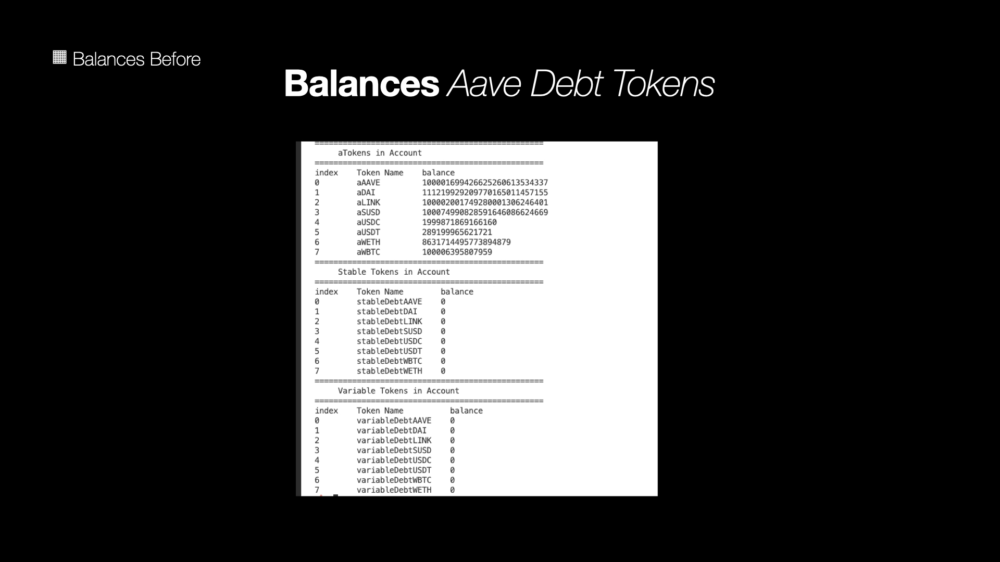
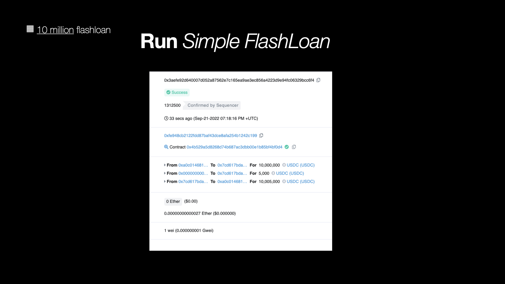
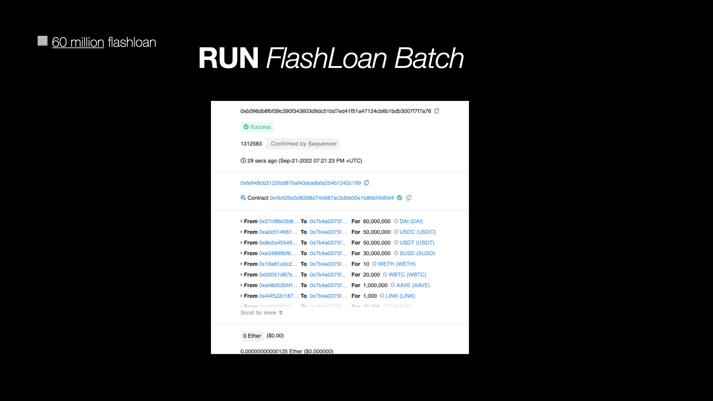

# Rush

## Project Category for ETHOnline 2022
- **Decentralized Finance (Defi)**
    - Rush to debt **freedom** ⤽ 🎠 ⤼

## GitHub Repository
- [**Rush Flashloans**](https://github.com/mmsaki/flash-loan-rush)

## Short Description
- **Rush** makes it easy for Defi users to borrow from Aave's **lending pool** but remain with `0` debt allowing you to possibly stay forever **debt free**.

## Long Description

- **Rush** is a product that interacts with **Aave v3 Core lending pool** to borrow assets using **flashloan contracts**. Defi users can rely on simple tools to borrow crypto assets. Sometimes borrowing assests can be a financial burden to you. When you **borrow assets** traditionally you are at risk of a forced **liquiditation** to pay off outstanding debt when the maket movements are against you. This will lead to **max losses** on your porfolio. Rush Flashloans provides an efficient way to benefit from your current borrowing positions. If you supplied **collateral** on Aave, then flahloans might benefit you. We want all the Defi users without any technical backgrounds to learn how to use flashloans without complications. We want to ensure Rush provides **secure contracts** to flashloan with Aave lending pools. Flashloans allow users to **stay debt free**. You only have to pay a **flashloan premium fee** currently at `0.09%`.

## How It's Made

- We used Aave V3 Core contracts and build Rush using their protocol. 
    - We use **Optimism Goerli** for testing
    - We deployed two contracts
        - `RushFlashLoan`
            - For borrowing multiple tokens
        - `RushSimpleFlashLoan`
            - For borrowing a single token
    - We supply liquidity to aave and received **atokens**
    - We call `.flashloan( )` on the lending pool contract
        - Our receiver will be the `RushFlashloan` contract we deployed
        - We can borrow tokens by providing an array of token addresses and amounts.
        - With enough net worth collateral you can borrow millions.

- Aave Flash loan fee
    - The flash loan fee is **initialized at deployment** to `0.09%` which is updated via aave Governance Vote. Use `FLASHLOAN_PREMIUM_TOTAL` to get current value.
    - Flashloan fee can be shared by the LPs (liquidity providers) and the **protocol treasury**. The `FLASHLOAN_PREMIUM_TOTAL` represents the total fee paid by the borrowers of which:
        - Fee to LP: `FLASHLOAN_PREMIUM_TOTAL - FLASHLOAN_PREMIUM_TO_PROTOCOL`
        - Fee to Protocol: `FLASHLOAN_PREMIUM_TO_PROTOCOL`

<!-- - Setting Up
    - Ensure we have enough funds when flashloaning
    - Calculate the profitability of liquidating loans vs gas costs
    - Ensure we have access toe the latest protocol user data
    - Fail safe security 
- Aave contracts and registry on Optimism 
    - [V3 Testnet Aave Address on Optimism Görli](https://docs.aave.com/developers/deployed-contracts/v3-testnet-addresses) -->

## Project Roadmap

- [x] Create Project 
    - [Loan Rush](https://ethglobal.com/showcase/rush-8s2mf)
- [ ] Checkin #1
    - Update: We Missed checkin #1
- [x] Create Logo
    - [Rush logo](./images/carousel.png)
- [x] Create Discord
    - [Discord](https://discord.gg/57TA3bHx62)
- [x] Submit Checkin #2 
    - How is the project coming along?
- [x] Create scripts
    - deploy_flashloan.py
    - aave_balances.py
    - run_flashloan.py
    - simple_flashloan.py
    - supply_token.py
    - withdraw_token.py
- [x] Project feedback Session Thu, Sep 15 02:00 PM
- [x] Create Presentation Sun, Sep 18 11:00 AM
- [ ] Bonus
    - Front end landing page
    - Users can connect metamask
    - User can call deposit WETH function
    - User can send flashloan
- [x] Project Check-in #3 Tue, Sep 20 11:00 AM
    - Is everything going as expected?
    - What are some things you need help with?
    - What do you need to complete your project?
- [ ] Project feedback Session Wed, Sep 21 02:00 PM
    - Present project for feedback
- [ ] ETHOnline Summit Fri, Sep 23 11:00 AM
    - If ready submit project
    - Record Video demonstration on how to use rush
- [ ] Submissions Due! Sun, Sep 25 02:00 PM
    - Submit project by 2:00pm
- [ ] Project Judging Mon, Sep 26 11:00 AM
    - Present to judges and sponsors
 

## Sponsors
- Aaave
- Optimism

