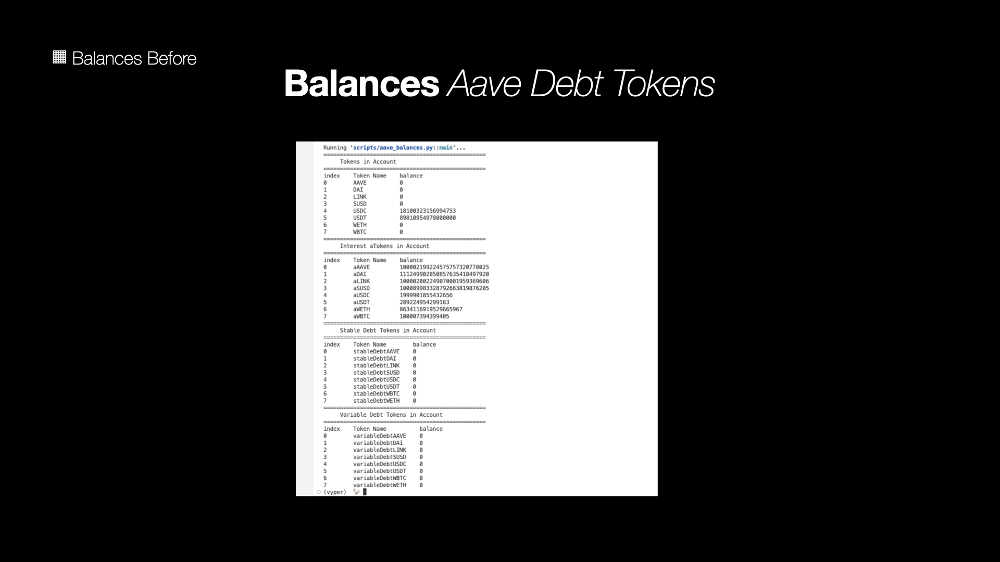
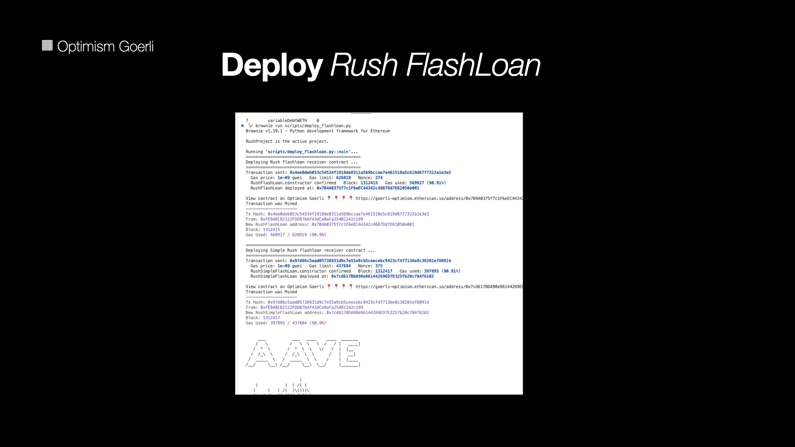
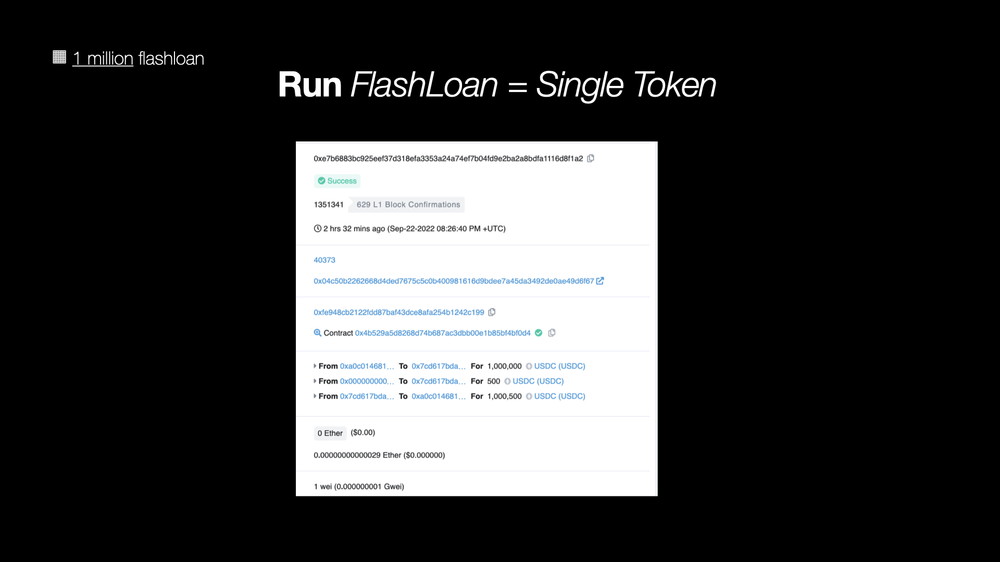
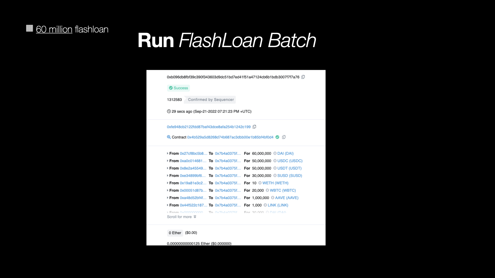
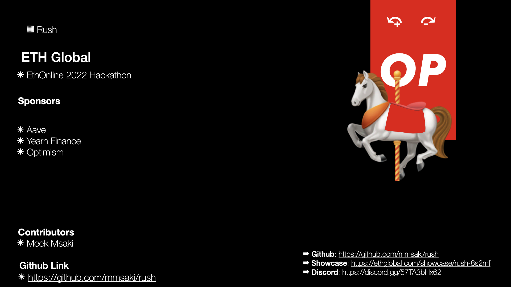

#  ▦Rush ⤽ ⤼ Flashloan Rush

## ▨Category for ETHOnline 2022

### **Decentralized Finance (Defi)** 
Rush ⤽ 🎠 ⤼ `0` debt

## ▨GitHub Repository
[**Rush Flashloans**](https://github.com/mmsaki/rush)

## ▨Short Description
**Rush** makes it easy for Defi users to borrow from Aave's **lending pool** but remain with `0` debt allowing you to possibly stay forever **debt free**. Later we will add our flashloan strategis to **Yearn Vaults** as a strategy to boost yields. 

## ▨Long Description

**Rush** provides you with python scripts that interacts with **Aave v3 Core lending pool** to borrow assets using **flashloan contracts**. Defi users can rely on simple tools to borrow crypto assets. Sometimes borrowing assets can be a financial burden to you. When you **borrow assets** traditionally you are at risk of a forced **liquiditation** to pay off outstanding debt when the maket movements are against you. This will lead to **max losses** on your porfolio. Rush Flashloans provides an efficient way to benefit from your current borrowing positions. If you supplied **collateral** on Aave, then flahloans might benefit you. We want all the Defi users without any technical backgrounds to learn how to use flashloans without complications. We want to ensure Rush provides **secure contracts** to flashloan with Aave lending pools. Flashloans allow users to **stay debt free**. You only have to pay a **flashloan premium fee** currently at `0.09%`.

You will not make any profits from using flashloans as they are on this repo.
| :warning: WARNING          |
|:---------------------------|
| I should warn you ...      |

## ▨How It's Made

- We used Aave V3 Core contracts to build Rush. 
    
    ↳ We deployed to **Optimism Goerli** for testing 

    ↳ We deployed two contracts
        
    - `RushFlashLoan`
        - For borrowing multiple tokens
    - `RushSimpleFlashLoan`
        - For borrowing a single token
    
    ↳ We ensure we have enough funds to pay flashloan fee.

    ↳ We call `.flashloan( )` on the lending pool contract
        
    - Our `RushFlashloan` contract will receive the funds and repay to aave with a flashloan fee.
        - We can add multiple tokens by providing the array of tokens and amounts we want to borrow.
        - With enough net-worth you can borrow upto millions!

- [1 million USDC flashloan - Etherscan](https://goerli-optimism.etherscan.io/tx/0xe7b6883bc925eef37d318efa3353a24a74ef7b04fd9e2ba2a8bdfa1116d8f1a2)

- [100 + million Tokens flashloan - Etherscan](https://goerli-optimism.etherscan.io/tx/0xb096db8fbf39c390f343603d9dc51bd7ed41f51a47124cb6b1bdb3007f7f7a76)

## ▨Aave Flash ⤽ ⤼ loan fee

The flash loan fee is **initialized at deployment** to `0.09%` which is updated via aave Governance Vote. Use `FLASHLOAN_PREMIUM_TOTAL` to get current value.

Flashloan fee can be shared by the LPs (liquidity providers) and the **protocol treasury**. 

The `premium_total` represents the total fee paid by the borrowers of which:

Fee to LP = `premium_total` - `flashloan_premium_to_protocol`

Fee to Protocol = `flashloan_premium_to_protocol`

# Yearn Vaults

We deployed some yearn vaults that would used flashloan strategies to boost returns.

[Vaults](./images/rush_flashloans/rush_flashloans.010.jpeg)

Still working on other features but this is what I have so far!

<!-- - Setting Up
    - Ensure we have enough funds when flashloaning
    - Calculate the profitability of liquidating loans vs gas costs
    - Ensure we have access toe the latest protocol user data
    - Fail safe security 
- Aave contracts and registry on Optimism 
    - [V3 Testnet Aave Address on Optimism Görli](https://docs.aave.com/developers/deployed-contracts/v3-testnet-addresses) -->

## ▨Roadmap

- [x] Create Project
    - [Loan Rush](https://ethglobal.com/showcase/rush-8s2mf)
- [ ] Checkin #1
   - Update: We Missed checkin #1
- [x] Create Logo
    - [Rush logo](./images/carousel.png)
- [x] Create Discord
    - [Discord](https://discord.gg/57TA3bHx62)
- [x] Submit Checkin #2 
    - How is the project coming along?
- [x] Create scripts
    - deploy_flashloan.py
    - aave_balances.py
    - run_flashloan.py
    - simple_flashloan.py
    - supply_token.py
    - withdraw_token.py
- [x] Project feedback Session Thu, Sep 15 02:00 PM
- [x] Create Presentation Sun, Sep 18 11:00 AM
- [ ] Bonus
    - Front end landing page
    - Users can connect metamask
    - User can call deposit WETH function
    - User can send flashloan
- [x] Project Check-in #3 Tue, Sep 20 11:00 AM
    - Is everything going as expected?
    - What are some things you need help with?
    - What do you need to complete your project?
- [ ] Project feedback Session Wed, Sep 21 02:00 PM
    - Present project for feedback
- [ ] ETHOnline Summit Fri, Sep 23 11:00 AM
    - If ready submit project
    - Record Video demonstration on how to use rush
- [ ] Submissions Due! Sun, Sep 25 02:00 PM
    - Submit project by 2:00pm
- [ ] Project Judging Mon, Sep 26 11:00 AM
    - Present to judges and sponsors
 

## ▧Sponsors
- Aaave
- Optimism
- Yearn Finance

